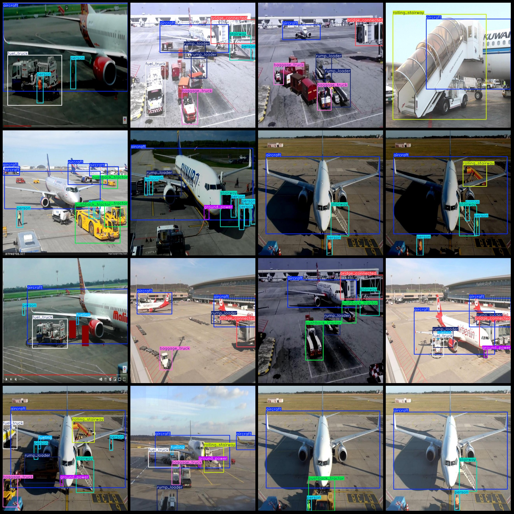
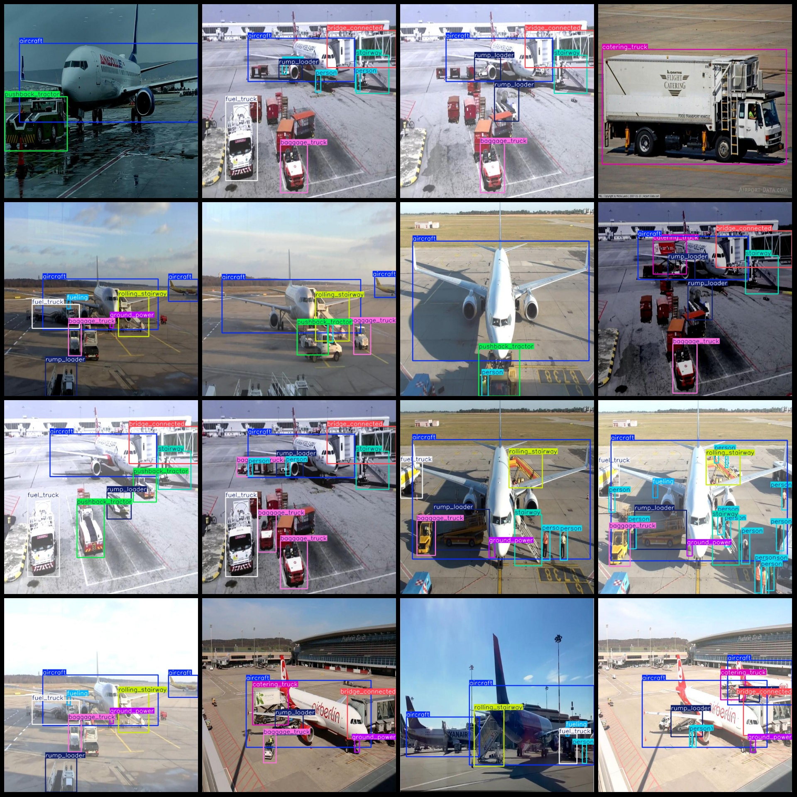

# Intelligent Transportation Airport Facilities, Equipment, and Vehicle Detection Dataset - VOC+YOLO Format - 1821 Images with 12 Categories

Please note that the dataset contains one-third of the images as the original ones, and the remaining are 1:2 augmented images. The dataset format is Pascal VOC format + YOLO format (the txt file does not contain the segmentation path, only contains the jpg images along with their corresponding VOC format xml files and YOLO format txt files).

number of images: 1821
annotation count: 1821
annotation count: 1821
annotationnumber of classes: 12
Annotation class names: ["aircraft", "baggage_truck", "bridge_connected", "catering_truck", "fuel_truck", "fueling", "ground_power", "person", "pushback_tractor"]
"rolling_stairway", "rump_loader", "stairway"]

The number of frames labeled in each category:
- Aircraft (aircraft) Frame Count = 2224
- Baggage Truck (Baggage Truck) Frames = 761
- Bridge Connected (Bridge Connected) Box Count = 645
The number of frames for the catering truck is 291.
- Fuel truck (Fuel truck) Box count = 773
- Fueling (Fueling) Frames = 255
- Ground power (Ground Power) Frame number = 584
- Person box count = 2564
- Pushback tractor box count = 679
- Rolling stairway (lift) count = 530
- Rump loader (Cargo Crane) Number of frames = 1188
The number of stairways (lifts/staircases) is 756.
The total number of frames is 11250.
image resolution: 640x640
Use annotation tool: labelImg
Annotation rule: draw a rectangle box around the class.
Important note: The dataset does not have splits for training, validation and testing.
Special statement: This dataset does not guarantee the accuracy of the trained model or weight file.
Image preview:
## Images

Here is a pay link on Stripe ( https://buy.stripe.com/3cs8yP7sY87d0vu9AB ). Please contact me lonlonago@foxmail.com after funding $89, and I will send you a complete data files , thank you!

